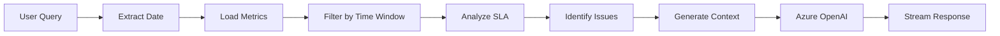

# RCA Analysis Chatbot - Development Documentation

## Project Overview
An AI-powered Root Cause Analysis (RCA) chatbot that analyzes derivatives batch processing failures and delays. The system monitors a 3-hour SLA from marker event arrival to DAG completion, identifying infrastructure bottlenecks across AWS services.

## Current Implementation Status ✅

### Completed Features
- ✅ Full-stack application with Flask backend and React frontend
- ✅ Dual authentication support (Certificate-based and API key)
- ✅ Real-time streaming UI with step-by-step analysis
- ✅ Intelligent metric preprocessing before AI analysis
- ✅ Time-window filtered infrastructure analysis
- ✅ Clean, minimal UI design (Claude/OpenAI style)
- ✅ Mixed timestamp format handling
- ✅ Python 3.12+ compatibility

## Technical Stack

### Backend (Python/Flask)
```
backend/
├── app.py                          # Main Flask application with endpoints
├── requirements.txt                # Python 3.11 dependencies
├── requirements-py312.txt          # Python 3.12+ specific dependencies
├── requirements-flexible.txt       # Flexible version constraints
├── .env.example                    # Environment variables template
├── cert/                          # Certificate directory for auth
│   └── README.md
└── services/
    ├── metric_loader.py           # Loads and parses JSON metrics
    ├── rca_analyzer.py           # Core RCA logic and SLA analysis
    ├── azure_ai_service.py       # API key authentication
    └── azure_ai_service_cert.py # Certificate-based authentication
```

**Key Technologies:**
- Flask 3.0.3 with Flask-CORS
- Azure OpenAI SDK 1.35.0
- Azure Identity 1.16.1 (for certificate auth)
- Pandas 2.2.0, NumPy 1.26.3
- Python-dotenv for configuration

### Frontend (React/TypeScript)
```
frontend/
├── src/
│   ├── App.tsx                    # Main app with theme provider
│   ├── components/
│   │   ├── SimpleChatInterface.tsx    # Main chat container
│   │   ├── SimpleMessageBubble.tsx    # Clean message display
│   │   ├── SimpleMessageList.tsx      # Message list container
│   │   ├── SimpleChatInput.tsx        # Minimal input component
│   │   └── [Legacy components...]     # Original complex UI components
│   ├── services/
│   │   └── api.ts                 # Backend API communication
│   └── types/
│       └── index.ts               # TypeScript interfaces
├── package.json
└── tsconfig.json                  # TypeScript strict mode config
```

**Key Technologies:**
- React 18.2 with TypeScript
- Material-UI (MUI) 5.14
- Inter font family for clean typography
- Axios for API calls
- UUID for message IDs
- Date-fns for timestamp handling

## Architecture & Data Flow

### 1. Metric File Structure
```
RCA_TOOL/                         # Project root
├── backend/
├── frontend/
├── markerEvent/                  # Marker arrival times
│   └── 2025-08-01_marker_event.json
├── dagDetails/                   # DAG processing details
│   └── 2025-08-01_dag_metrics.json
├── eksMetrics/                   # Kubernetes metrics
│   └── 2025-08-01_eks_metrics.json
├── sqsMetrics/                   # Queue metrics
│   └── 2025-08-01_sqs_metrics.json
└── rdsMetrics/                   # Database metrics
    └── 2025-08-01_rds_metrics.json
```

**Important:** Metric folders MUST be at project root level, NOT inside backend/

### 2. Data Processing Pipeline



**Key Processing Steps:**
1. **Date Extraction**: Parse natural language dates (e.g., "COB Aug 1st")
2. **Metric Loading**: Load all JSON files for the specified date
3. **Time Window**: Filter infrastructure metrics between marker arrival and DAG completion
4. **SLA Analysis**: Calculate processing duration and check 3-hour threshold
5. **Issue Detection**: Apply thresholds to identify critical/warning issues
6. **Context Creation**: Build concise summary for AI (not raw JSON)
7. **AI Enhancement**: Generate natural language explanation
8. **Streaming UI**: Display step-by-step progress in real-time

## Authentication Methods

### Certificate-Based (Production)
```env
AUTH_METHOD=certificate
AZURE_SPN_CLIENT_ID=your_service_principal_client_id
AZURE_TENANT_ID=your_tenant_id
AZURE_CERT_PATH=cert/apim-exp.pem
AZURE_OPENAI_ENDPOINT=https://your-resource.openai.azure.com/
AZURE_OPENAI_DEPLOYMENT=gpt-4o-2024-08-06
AZURE_OPENAI_API_KEY=placeholder-api-key  # Required but unused
USER_SID=1792420
```

### API Key (Development)
```env
AUTH_METHOD=api_key
AZURE_OPENAI_API_KEY=your_actual_api_key
AZURE_OPENAI_ENDPOINT=https://your-resource.openai.azure.com/
AZURE_OPENAI_DEPLOYMENT=gpt-4
```

## Critical Implementation Details

### Timestamp Handling
The system handles mixed timestamp formats:
- **DAG dates**: `2025-08-01 15:07:04.361812` (no timezone)
- **Infrastructure metrics**: `2025-08-01T15:07:04Z` (ISO with Z)
- **Marker events**: `2025-08-01T06:45:00Z` (ISO with Z)

### Threshold Configuration
```python
# EKS Thresholds
cpu_critical: 90%, cpu_warning: 80%
memory_critical: 90%, memory_warning: 80%
restarts_critical: 10, restarts_warning: 5

# RDS Thresholds
cpu_critical: 95%, cpu_warning: 90%
connections_critical: 250, connections_warning: 200
commit_latency_critical: 50ms, commit_latency_warning: 25ms
select_latency_critical: 100ms, select_latency_warning: 50ms

# SQS Thresholds
age_critical: 600s, age_warning: 300s
visible_critical: 1000, visible_warning: 500
```

### DAG Processing Logic
- Processes ALL entries in dagDetails (no filtering needed - all are derivatives)
- Calculates duration dynamically from start_date and end_date
- Uses run_id for unique identification
- Tracks both successful and failed runs

## UI/UX Design Decisions

### Current Design (Simplified)
- **Font**: Inter at 15px base size (increased readability)
- **Layout**: Single column, max-width container
- **Colors**: Minimal palette (grays, subtle accent)
- **Components**: Removed date picker, timeline panel, metrics panel
- **Messages**: Clean bubbles with "You"/"Assistant" labels
- **Streaming**: Step-by-step analysis with checkmarks

### Streaming Response Flow
```
✓ Checking marker event arrival time...
→ Marker arrived at [time]

✓ Analyzing DAG processing metrics...
→ Processing completed at [time]
→ Duration: X hours (SLA: 3 hours)

✓ Checking infrastructure metrics...
→ Analyzing EKS, RDS, and SQS performance

✓ Generating Root Cause Analysis...
[Full analysis appears]
```

## API Endpoints

### Core Endpoints
- `POST /api/chat` - Standard chat analysis
- `POST /api/chat/detailed` - Enhanced with step data
- `GET /api/metrics/{date}` - Raw metrics for a date
- `GET /api/health` - Backend health check
- `GET /api/available-dates` - List dates with data
- `GET /api/debug/paths` - Debug file locations

### Request/Response Format
```typescript
// Request
{
  "query": "How is derivatives processing for COB Aug 1st?",
  "date": "2025-08-01"  // Auto-extracted from query
}

// Response
{
  "analysis": "Natural language RCA explanation...",
  "timeline": [...],
  "metrics_summary": {...},
  "sla_status": {
    "breached": true,
    "duration_hours": 4.5,
    "excess_hours": 1.5
  },
  "root_causes": [...]
}
```

## Setup & Deployment

### Quick Start
```bash
# Python 3.11 or earlier
./setup.sh

# Python 3.12+
./setup-py312.sh

# Configure environment
cp backend/.env.example backend/.env
# Edit .env with your Azure credentials

# Place certificate (if using cert auth)
cp your-cert.pem backend/cert/apim-exp.pem

# Run services
./run-backend.sh   # Terminal 1
./run-frontend.sh  # Terminal 2
```

### Troubleshooting Scripts
- `setup-metrics.sh` - Verify metric file locations
- `frontend-fix.sh` - Fix frontend dependencies
- `setup-alt.sh` - Alternative setup with flexible deps

### Common Issues & Solutions

1. **Files showing "N/A"**
   - Check metric files are at project root (not in backend/)
   - Run `curl http://localhost:5000/api/debug/paths`
   - Verify file naming: `YYYY-MM-DD_<type>.json`

2. **Python 3.12 errors**
   - Use `setup-py312.sh` instead of `setup.sh`
   - Or downgrade to Python 3.11

3. **TypeScript errors**
   - Frontend uses strict mode
   - All catch blocks need explicit error handling

4. **Certificate auth failing**
   - Ensure cert is in `backend/cert/`
   - Check permissions: `chmod 600 backend/cert/*.pem`
   - Verify AZURE_SPN_CLIENT_ID and AZURE_TENANT_ID

## Development Workflow

### Adding New Features
1. Update metric analysis in `rca_analyzer.py`
2. Add preprocessing logic in `metric_loader.py`
3. Extend API endpoints in `app.py`
4. Update TypeScript types in `types/index.ts`
5. Modify UI components as needed

### Testing
```bash
# Test metric loading
curl http://localhost:5000/api/metrics/2025-08-01

# Test analysis
curl -X POST http://localhost:5000/api/chat \
  -H "Content-Type: application/json" \
  -d '{"query":"Check derivatives for Aug 1st","date":"2025-08-01"}'

# Debug paths
curl http://localhost:5000/api/debug/paths
```

## Performance Optimizations

### Token Efficiency
- Preprocess metrics locally (don't send raw JSON to AI)
- Extract only relevant data points within time window
- Create concise summaries with critical issues only
- Typical context: ~500 tokens vs ~5000 for raw data

### Response Time
- Metric loading: ~100ms
- Analysis: ~200ms
- AI response: 1-3 seconds
- Total: Under 4 seconds typical

## Future Enhancements (Not Implemented)

1. **Real WebSocket streaming** (currently simulated)
2. **Historical comparison** across multiple dates
3. **Export functionality** (PDF reports)
4. **Caching layer** for metrics
5. **Predictive analysis** using trends
6. **Slack/Teams integration**
7. **Multi-product support** beyond derivatives

## Key Design Principles

1. **Simplicity First**: Clean UI over feature-rich
2. **Token Efficiency**: Preprocess before AI
3. **Robust Parsing**: Handle multiple timestamp formats
4. **Clear Feedback**: Step-by-step progress
5. **Fallback Logic**: Work without AI if needed
6. **Flexible Auth**: Support enterprise and dev setups

## Session Context for Claude

When working on this project:
- The metric files MUST be at project root, not in backend/
- DAG timestamps don't have 'Z' suffix, others do
- All DAG entries are derivatives (no filtering needed)
- Frontend uses TypeScript strict mode
- Python 3.12 needs special handling (no ImpImporter)
- Certificate auth still requires API key parameter
- UI should remain minimal and clean
- Always preprocess metrics before sending to AI

## Git Repository
https://github.com/Ayush37/RCA_TOOL

Last updated: Session where we implemented streaming UI and fixed timestamp parsing